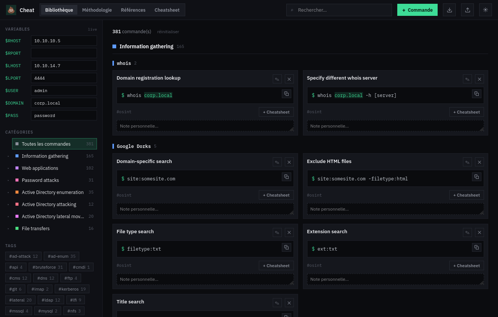

# 💩 Cheat

> **The operational memory of a pentest — commands, methodology, references and
> cheatsheets in one offline workshop, with live variables threaded through
> everything.**

**Cheat** keeps everything you reach for during a penetration test in one place —
reusable **commands**, step-by-step **methodologies**, external **references**,
and target-scoped **cheatsheets** — and resolves **live variables**
(`$RHOST`, `$LHOST`, `$USER`, …) identically everywhere a command appears. Type a
target once and every command, in every view, shows the concrete, copy-ready
line.

It's built for **OSCP** prep (the Offensive Security Certified Professional exam)
and hands-on pentest work, and runs as a **single self-contained binary** on your
own machine — no cloud, no accounts, no telemetry. The UI is in **French**.



## Contents

- [Why Cheat?](#why-cheat)
- [Highlights](#highlights)
- [Live variables](#live-variables)
- [Quick start](#quick-start)
- [Configuration](#configuration)
- [Security & OPSEC](#security--opsec)
- [Import / export](#import--export)
- [Tech stack](#tech-stack)
- [Project layout](#project-layout)
- [License](#license)

## Why Cheat?

During an engagement your knowledge is scattered: commands live in a dozen
cheatsheets, methodology in a notepad, useful links in the browser — and you
retype the same target IP, listener, and credentials into every one of them.

Cheat pulls it into a single workshop and makes the target **a variable**. Set
`$RHOST` once and it propagates to every command in the library, every linked
step in a methodology, and every entry in a cheatsheet. No more find-and-replace
across notes.

## Highlights

- **Bibliothèque** — a searchable command library grouped by **category → tool**
  (tools sorted alphabetically). Tokenized, accent-insensitive search; filter by
  category, tool or tag; full create/edit/delete with on-the-fly
  categories/tools/tags; per-command notes; one-click copy of the *resolved*
  command; **star a command** to pin it to the top of its tool group.
- **Méthodologie** — reusable **roadmaps** of phases and checkable steps with
  per-phase and global progress. A step can link a command, shown expanded and
  resolved inline. Edit mode with drag-and-drop reordering (including across
  phases) and a progress reset.
- **Références** — external links with auto-extracted domain and tags, full-text
  and tag filtering, and URL validation on add/edit.
- **Cheatsheet** — assemble named, target-scoped cheatsheets from library
  commands, then **export to Markdown or PDF** — both emit raw `$TOKEN`s by
  default; a single opt-in toggle resolves the values into either format, and a
  confirmation guards any resolved export that would write a sensitive value
  (`$PASS`) to disk.
- **Live variables** — substituted everywhere, with three clear states and
  auto-detection of new ones (see below).
- **Themeable & dense** — dark / light, terminal-style, self-hosted fonts.
- **Local persistence** — everything (except variable *values*) is saved to a
  local SQLite database and survives restarts.
- **Import / export** — back up or move your whole dataset as a single JSON file.

## Live variables

A variable is a `$TOKEN` you define once and reuse everywhere. Cheat ships 7
built-ins — `$RHOST`, `$RPORT`, `$LHOST`, `$LPORT`, `$USER`, `$DOMAIN`, `$PASS` —
and you can add your own.

Set `$RHOST = 10.10.10.5` in the sidebar, and a stored command template like:

```
nmap -p- --min-rate 5000 -sV $RHOST
```

renders (and copies) as `nmap -p- --min-rate 5000 -sV 10.10.10.5` — in the
library, in a methodology step that links it, and in any cheatsheet that
includes it.

- **Three render states**: *resolved* (has a value, shown green), *empty*
  (defined but blank), *undefined* (an unknown `$TOKEN`, shown dimmed).
- **Auto-detection**: type a new `$TOKEN` into any command and it appears in a
  **“Détectées”** strip in the sidebar — one click adopts it as a variable you
  can give a value.
- **Rename cascades**: renaming a variable rewrites `$OLD → $NEW` across every
  command that uses it.
- **Values are memory-only**: variable *values* (your target IP, password, …)
  are **never** written to disk or the export — they live in memory and reset on
  reload. Only the variable *names* and command templates are stored. This is a
  deliberate OPSEC choice (see below).

## Quick start

You need a container engine — **podman** (preferred) or **docker** — and `make`.
Everything runs inside a container; nothing is installed on the host.

```sh
make rebuild        # build the image and (re)start it  → http://localhost:8787
```

That's the usual one-shot. The individual targets:

```sh
make build          # build the image (podman/docker auto-detected)
make up             # start detached          (make logs | make down)
make run            # start in the foreground (Ctrl-C to stop)
make dev            # dev mode: Vite HMR (:5173) + Go API (:8787)
make clean          # remove the container, image, dev volumes and network (keeps data)
make purge          # clean + delete the cheat-data volume (destroys your dataset)
```

Then open **http://localhost:8787**. On first launch the app seeds a starter
dataset you can edit or replace.

## Configuration

All optional, passed as `make` variables (e.g. `make up CHEAT_PORT=9000`):

| Variable | Default | Purpose |
|---|---|---|
| `CHEAT_PORT` | `8787` | Listen / published port. |
| `CHEAT_HOST` | `0.0.0.0` | Bind address inside the container. `127.0.0.1` = loopback-only. |
| `PUBLISH` | `-p 0.0.0.0:$(CHEAT_PORT):$(CHEAT_PORT)` | Container port publishing. |

- **Data** lives in the `cheat-data` volume (`CHEAT_DB=/data/cheat.db` inside the
  container) and survives restarts; `make clean` keeps it, `make purge` deletes it.
- **Loopback-only** (recommended if you don't need LAN access):
  `make up CHEAT_HOST=127.0.0.1 PUBLISH='-p 127.0.0.1:8787:8787'`.

## Security & OPSEC

Cheat is a single-user tool with **no authentication and no TLS**, designed to
run on a machine you control.

- **Exposure** — by default the server binds `0.0.0.0` and the port is published
  on all interfaces, so it is **reachable on your LAN**. Anyone who can reach the
  port has full read/write access to the dataset. Bind `127.0.0.1` (above) to
  keep it local, firewall the port, or reach it over an SSH tunnel.
- **Variable values are memory-only** — target IPs, passwords and the like are
  never written to the database, `localStorage`, or the JSON export; they reset
  on reload.
- **No at-rest encryption** — the database stores your commands, methodology,
  references, free-text notes/targets/URLs and any **captured command output**
  (methodology step results, which can contain credentials, hashes or other
  sensitive data) in cleartext. Rely on OS full-disk encryption. **Markdown and PDF exports emit raw `$TOKEN`s by default** —
  resolving values into an export is an explicit opt-in that warns before writing
  a sensitive value (`$PASS`) to disk.
- **Zero network egress** — no CDN, self-hosted fonts, no telemetry, no
  auto-update. Inputs set `spellcheck="false"` / `autocorrect="off"` to stop the
  browser or extensions from shipping field contents to remote services;
  outbound links use `rel="noopener noreferrer"`.

## Import / export

Export produces — and import expects — a **single JSON object** (`AppState`).
Import is a **full REPLACE** (it overwrites everything, so export first to back
up). Variable *values* are never part of the file. The easiest way to get a valid
file is to **Export** one and edit it. Every top-level key must be present (arrays
may be empty, maps `{}`); import rejects a file whose `commands` is not an array.

```json
{
  "categories":  [{ "key": "infogathering", "label": "Information gathering", "color": "#5e9bff" }],
  "commands":    [{ "id": "n1", "category": "infogathering", "tool": "nmap", "title": "Scan complet TCP", "template": "nmap -p- $RHOST", "desc": "Tous les ports", "tags": ["recon"], "favorite": true }],
  "references":  [{ "id": "r1", "title": "HackTricks", "url": "https://book.hacktricks.xyz", "desc": "", "tags": ["general"] }],
  "roadmaps":    [{ "id": "services", "label": "Machine — Services", "phases": [{ "id": "p1", "label": "Reconnaissance", "steps": [{ "id": "s1", "text": "Scan TCP complet", "commandId": "n1" }] }] }],
  "cheatsheets": [{ "id": "cs1", "title": "Cheatsheet — HTB Lab", "target": "", "commandIds": ["n1"] }],
  "notes":       { "n1": "note perso attachée à la commande n1" },
  "checks":      { "s1": true },
  "openSteps":   { "s1": false },
  "results":     { "s1": "22/tcp open ssh\n80/tcp open http" },
  "settings":    { "theme": "dark", "activeRoadmap": "services", "activeSheet": "cs1" }
}
```

| Key | Shape | Notes |
|---|---|---|
| `categories[]` | `{ key, label, color }` | `color` is a CSS hex; the 18 built-ins keep their canonical keys/labels. |
| `commands[]` | `{ id, category, tool, title, template, desc, tags[], favorite? }` | `category` is a `categories[].key`; `template` may contain `$VAR` tokens; a command's own tool is never one of its tags; `favorite` (optional bool, default `false`) pins the command to the top of its tool group. |
| `references[]` | `{ id, title, url, desc, tags[] }` | `url` should be `http(s)`/`mailto`. |
| `roadmaps[]` | `{ id, label, phases[] }` | `phases[] = { id, label, steps[] }`, `steps[] = { id, text, commandId? }`. |
| `cheatsheets[]` | `{ id, title, target, commandIds[] }` | each `commandIds` entry → a `commands[].id`. |
| `notes` | `{ [commandId]: string }` | per-command note. |
| `checks` / `openSteps` | `{ [stepId]: boolean }` | methodology progress / expanded state. |
| `results` | `{ [stepId]: string }` | saved command output/result captured per methodology step. |
| `settings` | `{ theme, activeRoadmap, activeSheet }` | `theme` = `"dark"`\|`"light"`; `activeRoadmap` = a roadmap id or `null`; `activeSheet` = a cheatsheet id. |

- **IDs** are arbitrary unique strings; keep cross-references consistent
  (`steps[].commandId`, `cheatsheets[].commandIds`, and the `notes`/`checks`/
  `openSteps`/`results` keys). References to a missing id are dropped.
- Variable **values** (`$RHOST`, `$PASS`, …) are **not** in the file — they are
  memory-only and reset on load.

## Tech stack

One self-contained **Go** binary (Gin) embeds the compiled **Vite + React +
TypeScript** SPA via `go:embed` and serves it alongside a same-origin REST API.
Storage is **pure-Go GORM/SQLite** (no CGO → a static binary). The API is lean
and whole-state: `GET`/`PUT /api/state`, `POST /api/import`, `GET /api/export`,
`GET /api/health`.

## Project layout

- `frontend/` — Vite + React + TypeScript SPA.
- `backend/` — Go server (Gin, GORM/SQLite, `go:embed` of the built SPA).
- `Makefile`, `Dockerfile`, `.dockerignore` — build & delivery.
- `SPEC.md` — the authoritative specification (with an implementation-status
  addendum for post-spec changes).
- `CHANGELOG.md` — release notes.
- `tasks/` — the spec questionnaire, decisions log and review adjustments.

## License

**GNU General Public License v3.0** — Copyright © 2026 KnackyCorp.

Cheat is free software: you can redistribute it and/or modify it under the terms
of the GNU General Public License as published by the Free Software Foundation,
either version 3 of the License or (at your option) any later version. It is
distributed in the hope that it will be useful, but **without any warranty**. See
[`LICENSE`](./LICENSE) for the full text.
